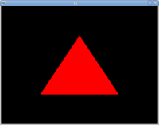
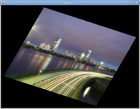
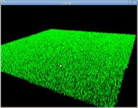
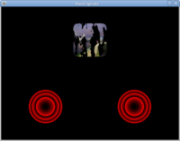
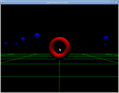

opengl_reference
================

This is going to be a repository of modern (3.3/4.x) OpenGL programs.
Most of these will be either exploring/demonstrating concepts or
be framework/template programs for starting new projects.

There are better repositories of modern OpenGL programs to
use for learning because they're more complete/organized,
they go with a book etc.  However, this is mostly for my own
personal use/code and will be constantly changing.  Writing
a bunch of OpenGL programs will also force me to learn glm
and finish my own OpenGL math/helper code.

I'll try to maintain a table/list of programs here.  Maybe
I'll split them up by category (templates/frameworks, feature examples, demos, "games") later.

| Program | Description | Image |
| --- | --- | --- |
| ex1.c | Hello Triangle                                            |  |
| ex2.c | Hello Interpolation                                       |  |
| ex3.cpp | Load a model from ./media/models.  Switch between Gouraud and Phong shading with s.  Switch between polygon modes with p. |  |
| ex4.cpp | Switch between textures with 1, filtering modes with f, zoom/rotate with arrow keys |  |
| grass.cpp | Based on example in superbible, uses flying controls, WIP |  |
| point_sprites.c | Point Sprite example, uses multitexturing and discard keyword in fragment shader to "disolve" textured point.  |  |
| sphereworld_color.cpp | Based on SphereWorld example from SB with ADS lighting, moving/rotating objects, with flying controls.  |  |
| flying.cpp | Template with 6DOF flying controls ala Descent. Mouse + WASDQE + LShift + Space |  |
| left_handed.cpp | [OpenGL *is* left handed](https://stackoverflow.com/questions/5168163/is-the-opengl-coordinate-system-right-handed-or-left-handed/22675164#22675164). |  |
