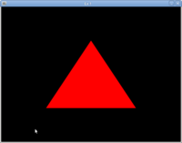
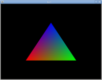
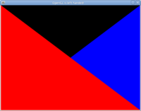

opengl_reference
================

This is going to be a repository of modern (3.3/4.x) OpenGL programs.
Most of these will be either exploring/demonstrating concepts or
be framework/template programs for starting new projects.

There are better repositories of modern OpenGL programs to
use for learning because they're more complete/organized,
they go with a book etc.  However, this is mostly for my own
personal use/code and will be constantly changing.  Writing
a bunch of OpenGL programs will also force me to learn glm
and finish my own OpenGL math/helper code.

I'll maintain a table/list of programs here

| Program | Image |
| --- | --- |
| ex1.cpp |  |
| ex2.cpp |  |
| left_handed.cpp |  |
